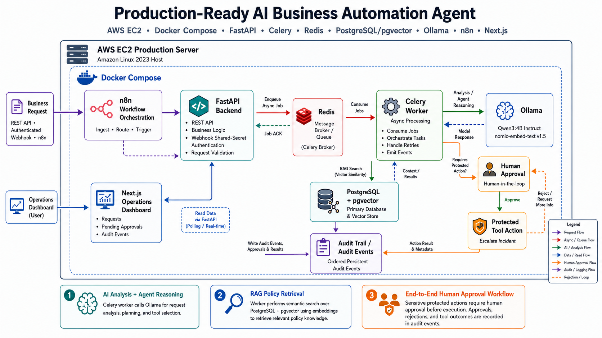
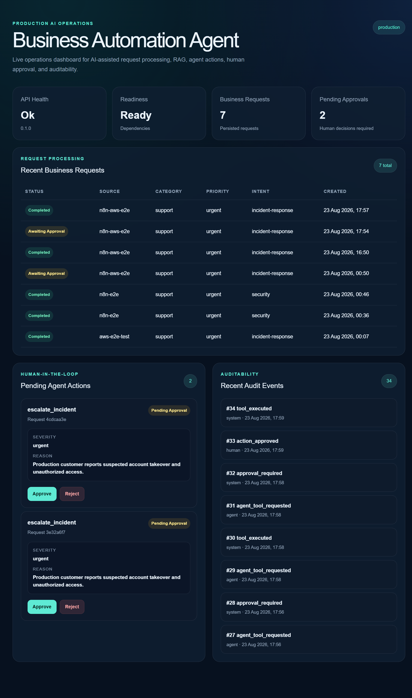
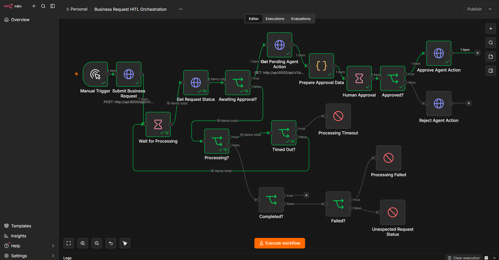
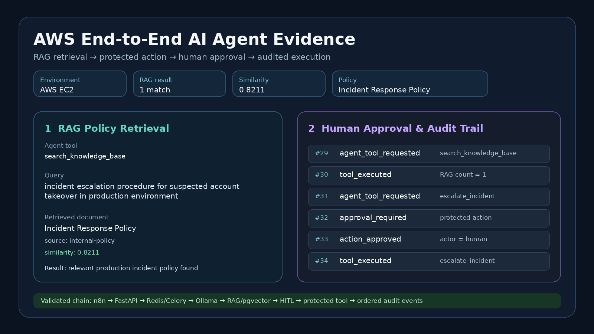

# Production-Ready AI Business Automation Agent

A production-style AI business automation platform that combines **FastAPI, PostgreSQL + pgvector, Redis, Celery, Ollama, n8n, Next.js, Docker, AWS EC2, and GitHub Actions**.

The system accepts business requests, processes them asynchronously, uses an AI agent to analyze requests and call tools, retrieves internal policy through RAG, pauses protected actions for human approval, and records ordered audit events for traceability.

---

## Key Highlights

- **AI Agent Tool Calling** — the agent can select and invoke registered tools based on request context.
- **Retrieval-Augmented Generation** — semantic search over internal knowledge using Ollama embeddings and PostgreSQL + pgvector.
- **Human-in-the-Loop Governance** — protected actions require explicit human approval before execution.
- **Async Processing** — Redis + Celery decouple request intake from long-running AI processing.
- **Workflow Orchestration** — n8n coordinates request submission, polling, timeout handling, approval, and protected action execution.
- **Operations Dashboard** — Next.js UI surfaces health, readiness, requests, pending approvals, and audit events.
- **AWS Deployment** — the full Docker Compose stack has been deployed and validated on AWS EC2.
- **Auditability** — ordered persistent audit events capture tool requests, approvals, rejections, and execution results.
- **CI Validation** — GitHub Actions runs backend tests, frontend lint/build checks, and Docker build validation.
- **61 Passing Backend Tests** — covering core API, workflow, agent, webhook, approval, RAG, and audit behavior.

---

## Architecture



---

## Operations Dashboard

The operations dashboard provides a live view of request processing, pending human approvals, and ordered audit events.



---

## n8n Human-in-the-Loop Workflow

This workflow orchestrates business request processing, polling, timeout handling, human approval, and protected action execution inside n8n.



---

## AWS RAG and Audit Evidence

A validated AWS end-to-end run shows the agent retrieving the relevant internal incident-response policy, requesting a protected escalation action, waiting for human approval, and recording the complete ordered audit trail.



---

## Validated End-to-End Flow

```text
Business Request
        ↓
n8n
        ↓
FastAPI
        ↓
Redis / Celery
        ↓
Ollama Qwen3
        ↓
AI Analysis
        ↓
Agent Tool Calling
        ↓
search_knowledge_base
        ↓
Ollama Embeddings
        ↓
PostgreSQL + pgvector
        ↓
Relevant Internal Policy
        ↓
Protected Agent Action
        ↓
Human Approval
        ↓
Tool Execution
        ↓
Ordered Audit Trail
```

A real AWS validation run retrieved:

```text
Document: Incident Response Policy
Source: internal-policy
Similarity: ~0.821
```

The same run then produced the following ordered audit sequence:

```text
agent_tool_requested
tool_executed
agent_tool_requested
approval_required
action_approved
tool_executed
```

---

## Core Components

### FastAPI Backend

The backend provides:

- Business request APIs
- Authenticated webhook intake
- Agent action APIs
- Human approval / rejection endpoints
- Audit event APIs
- Health and readiness endpoints

Example endpoints:

```text
POST /api/v1/requests
POST /api/v1/webhooks/business-requests
POST /api/v1/agent-actions/{action_id}/approve
POST /api/v1/agent-actions/{action_id}/reject
```

### Async Processing

Business requests are processed asynchronously through:

```text
FastAPI
→ Redis
→ Celery Worker
```

The worker handles:

- AI request analysis
- Agent execution
- RAG retrieval
- Tool calling
- Approval-required state transitions
- Retryable dependency failures

The AWS deployment uses a resource-conscious Celery configuration with worker concurrency limited to one process.

### AI Provider

The system uses Ollama for local/self-hosted AI inference.

```text
Model:
qwen3:4b-instruct

Embedding Model:
nomic-embed-text:v1.5
```

This allows the project to run without relying on paid external AI APIs.

### Retrieval-Augmented Generation

The RAG pipeline follows:

```text
Knowledge Document
        ↓
Text Chunking
        ↓
Embedding Generation
        ↓
PostgreSQL + pgvector
        ↓
Query Embedding
        ↓
Cosine Similarity Search
        ↓
Relevant Knowledge Chunk
```

Embeddings use `768` dimensions.

### AI Agent

The current registered tools include:

```text
search_knowledge_base
escalate_incident
```

The agent uses `search_knowledge_base` when a request depends on business-specific policy or guidance.

High-impact tools such as `escalate_incident` require human approval.

### Human-in-the-Loop

Protected actions are not executed immediately.

```text
Agent requests protected action
        ↓
approval_required
        ↓
Human reviews request
        ↓
Approve / Reject
        ↓
Protected tool execution
```

### Audit Trail

Important agent and approval activity is persisted as ordered audit events.

Examples:

```text
agent_tool_requested
tool_executed
approval_required
action_approved
action_rejected
```

This provides traceability for:

- What the agent requested
- Which tools were executed
- Which actions required approval
- What decision the human made
- What result the protected action produced

### n8n Orchestration

n8n is used as the orchestration layer rather than the core application backend.

```text
Submit Business Request
        ↓
Poll Request Status
        ↓
Awaiting Approval?
        ↓
Get Pending Agent Action
        ↓
Human Approval
        ↓
Approve / Reject
```

The workflow includes:

- Polling
- Processing timeout protection
- Completed-state handling
- Failure handling
- Unexpected-state handling
- Human approval forms

AWS polling timeout: `300 seconds`.

### Frontend

The Next.js operations dashboard displays:

- Backend health
- Readiness status
- Business request counts
- Business requests
- Pending approvals
- Audit events

The frontend uses a server-side backend integration pattern rather than exposing internal service URLs directly to the browser.

---

## AWS Deployment

The complete stack has been deployed and validated on AWS EC2.

Deployment components:

```text
PostgreSQL + pgvector
Redis
FastAPI
Celery Worker
Ollama
n8n
Next.js
```

All services run through Docker Compose.

Internal infrastructure services such as PostgreSQL, Redis, and Ollama are not exposed publicly.

During validation, application services were accessed through SSH tunnels instead of opening application ports directly to the internet.

```text
Local Browser
      ↓
SSH Tunnel
      ↓
AWS EC2
      ↓
Next.js / FastAPI / n8n
```

The EC2 host uses **Amazon Linux 2023**.

---

## Docker

Production-style containerization includes:

- Backend Docker image
- Next.js standalone production image
- PostgreSQL + pgvector
- Redis
- Ollama
- n8n

The frontend uses the Next.js standalone build output for its production container.

---

## CI

GitHub Actions validates the application on pushes and pull requests.

Current CI checks include:

```text
Backend Tests
Frontend Lint
Frontend Production Build
Docker Build
```

The project currently implements **CI**.

Automated production deployment is not claimed as completed CD.

---

## Testing

The backend test suite currently has:

```text
61 passing tests
```

Coverage includes:

- API behavior
- Business request lifecycle
- Agent actions
- Human approval
- Webhooks
- RAG behavior
- Audit trail behavior

---

## Reliability and Observability

Implemented reliability and observability features include:

- Health endpoint
- Readiness endpoint
- Structured logging
- Request IDs
- Async processing
- Retryable dependency handling
- Processing timeout protection
- Persistent audit events
- Human approval gates
- Docker health checks

---

## Security Design

Implemented controls include:

- Webhook shared-secret authentication
- Protected agent actions requiring human approval
- Internal Docker service networking
- PostgreSQL / Redis / Ollama not publicly exposed
- Secrets stored outside Git
- n8n encryption key provided at runtime
- AWS infrastructure accessed through SSH

Public production exposure is intentionally not enabled yet.

Before public deployment, the next security layer would include:

- Application authentication
- Authorization / roles
- HTTPS
- Secure reverse proxy or load balancer
- Public-domain configuration
- Additional rate limiting and security hardening

---

## Tech Stack

### Backend

- Python
- FastAPI
- SQLAlchemy
- Alembic
- Pydantic
- Celery
- Redis
- PostgreSQL
- pgvector

### AI / RAG

- Ollama
- Qwen3
- nomic-embed-text
- Agent Tool Calling
- RAG
- Vector Search

### Automation

- n8n
- Webhooks
- Human-in-the-Loop

### Frontend

- Next.js
- React
- TypeScript

### Infrastructure

- Docker
- Docker Compose
- AWS EC2
- GitHub Actions

---

## Repository Structure

```text
.
├── backend/
│   ├── app/
│   │   ├── agent/
│   │   ├── ai/
│   │   ├── api/
│   │   ├── db/
│   │   ├── embeddings/
│   │   ├── models/
│   │   ├── rag/
│   │   └── worker/
│   └── Dockerfile
│
├── frontend/
│   ├── app/
│   ├── components/
│   └── Dockerfile
│
├── n8n/
│   └── workflows/
│       └── business-request-hitl.json
│
├── docs/
│   └── images/
│       ├── architecture.png
│       ├── dashboard-full.png
│       ├── n8n-hitl-workflow.png
│       └── aws-rag-audit-evidence.png
│
├── alembic/
├── .github/
│   └── workflows/
├── compose.aws.yaml
└── README.md
```

---

## Local Development

The project is designed to run through Docker-based infrastructure combined with local application development.

Required infrastructure services include:

- PostgreSQL
- Redis
- Ollama

Environment configuration is provided through local environment variables.

Secrets must never be committed to Git.

---

## Production-Style Design Decisions

This project intentionally avoids unnecessary architectural complexity.

Kubernetes, Kafka, large-scale microservice decomposition, and multi-agent orchestration were not added simply to increase the technology count.

Instead, the design focuses on:

- Clear service boundaries
- Async background processing
- Reliable persistence
- AI tool governance
- RAG
- Human approval
- Auditability
- Containerization
- Cloud deployment
- Observability

The goal is to demonstrate production-oriented engineering decisions rather than maximize architectural complexity.

---

## Project Status

Core application functionality and the AWS end-to-end workflow are complete and validated.

Validated:

- FastAPI backend
- PostgreSQL + pgvector
- Redis
- Celery
- Ollama AI inference
- Embeddings
- RAG ingestion
- RAG semantic retrieval
- Agent tool calling
- Human-in-the-Loop
- Ordered audit trail
- n8n orchestration
- Next.js frontend
- Docker deployment
- AWS deployment
- GitHub Actions CI

Remaining work is primarily optional public-exposure security hardening and optional deployment automation.

---

## Why This Project

The project demonstrates how modern AI capabilities can be integrated with conventional software engineering practices.

Rather than building a standalone chatbot, it combines:

```text
AI
+
Backend Engineering
+
Database Design
+
Async Processing
+
RAG
+
Agent Tool Governance
+
Human Approval
+
Workflow Automation
+
Cloud Deployment
+
Observability
```

into one end-to-end application.
